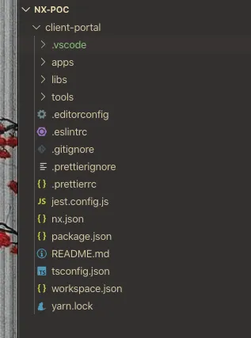

---
id: "d02ad436-6db2-4a75-acd4-f8db700b8cc6"
date: "2020-01-30T19:44:00.000Z"
title: "Setup Monorepo Architecture"
summary: undefined
readTime: undefined
tagIds: ["4469af31-5078-4ec0-b68a-b682f24ecfb4","e1463b23-59a7-4c1e-8051-3863f38a61b9","a82004cd-5435-4ab5-af04-c0898ae2044c","3f81f427-9437-4831-b13c-19bb283ee677","1c2bc8da-3c79-49cb-af98-a5ce7ffd415a","ffcd889d-91ab-49a0-9ff6-e7192fced192","300d269c-1541-4451-b9e7-f5560bef1034","3990d776-a825-4591-8781-f6be472b9c0b"]
tags: [{"id":"4469af31-5078-4ec0-b68a-b682f24ecfb4","name":"XP - Sprint #39","icon":""},{"id":"e1463b23-59a7-4c1e-8051-3863f38a61b9","name":"Monorepos","icon":"👨‍👩‍👦‍👦"},{"id":"a82004cd-5435-4ab5-af04-c0898ae2044c","name":"Software Engineering","icon":"⚙"},{"id":"3f81f427-9437-4831-b13c-19bb283ee677","name":"Frontend","icon":""},{"id":"1c2bc8da-3c79-49cb-af98-a5ce7ffd415a","name":"XP Miami (Offshore)","icon":""},{"id":"ffcd889d-91ab-49a0-9ff6-e7192fced192","name":"Blog","icon":"🌐"},{"id":"300d269c-1541-4451-b9e7-f5560bef1034","name":"Architecture","icon":""},{"id":"3990d776-a825-4591-8781-f6be472b9c0b","name":"POC","icon":""}]
--- 
 
# Monorepos

In order to maintain everything in one place and make somethings easier to do, we've decided to try monorepos for client portal. I know, monorepos could sound messy, but the community have been using a lot of them and many incredible tools have been appearing. 

At first I watched Ben's wad tutorial on Monorepos:

<iframe src="https://www.youtube.com/embed/p6qoJ4apCjA" frameborder="0" allow="accelerometer; autoplay; clipboard-write; encrypted-media; gyroscope; picture-in-picture" allowfullscreen></iframe>

<iframe src="https://www.youtube.com/embed/GT5UDa0I1Lc" frameborder="0" allow="accelerometer; autoplay; clipboard-write; encrypted-media; gyroscope; picture-in-picture" allowfullscreen></iframe>

At this point, you're probably very confident that _Lerna_ is the way to go, at least thats what I thought until I find out about [Nx](https://nx.dev/web)

<iframe src="https://www.youtube.com/embed/E188J7E_MDU" frameborder="0" allow="accelerometer; autoplay; clipboard-write; encrypted-media; gyroscope; picture-in-picture" allowfullscreen></iframe>

The good things about NR is that it seems to be founded by a Ex Googler. Nx helps you to implement good practices like the ones used at _**Google, Mircosoft and Facebook**_ that's what they say at least.

## Key Differences at Front

### **NX**

- Heavily Opinated
- Full Suite
- Cypress Included
- Focus on Backend Frontend Integration

### **Lerna**

- Unopinated
- Focus on multiple projects (npm packages)

So let's find out!

My goal is to create a project using each of the monorepo tools so I can have a better opinion on which one to choose for my current problem

## My Goal

Our goal is to create a project that contains

	- Mongodb
	- Webapi (Express) (GraphQL)
	- React Webapp
	- Cypress E2E

# Lerna

Lerna's getting started is pretty straightforward but unfortunaly since lerna is not an opinated tool, it doesn't tech you or guide you on how should you build your project.

Fortunatly, Erzhan Torokulov wrote this incredible blog post on medium with his opinions on how to [get started with lerna](https://medium.com/@erzhtor/javascript-monorepo-with-lerna-5729d6242302)

Other resources:

- [https://github.com/benawad/react-apollo-monorepo](https://github.com/benawad/react-apollo-monorepo)
- [https://dev.to/shnydercom/monorepos-lerna-typescript-cra-and-storybook-combined-4hli](https://dev.to/shnydercom/monorepos-lerna-typescript-cra-and-storybook-combined-4hli)

## Conclusion

Lerna is a good very flexible tool! Is probably one of the bests tools out there to help you de-couple big projects.

# Nx

Nx tutorials are simply awesome, they have a lot of youtube videos with great explanation. The first thing that you notice while using Nx for the first time is it's knowledge of how big applications work. It already comes with e2e using cypress and a lot of things that helps you to share code on big companies.

One magical thing Nx have is a graph of your dependencies. By using this graph Nx reduces the time of build and test on your pipeline since it only lint/test/executes what actually needs. This makes Nx veeeery scalable for big projects. Nx also uses a lot of resources to extend the linting rules and make them work nicely with a base set of rules

Nx enforces a lot of good practices right out of the box. Some things that I've found interesting contain:

Nx Monorepos

## Yarn Workspaces

While doing the monorepo, I've stumbled into Yarn Workspaces and we ended up using yarn workspaces.

